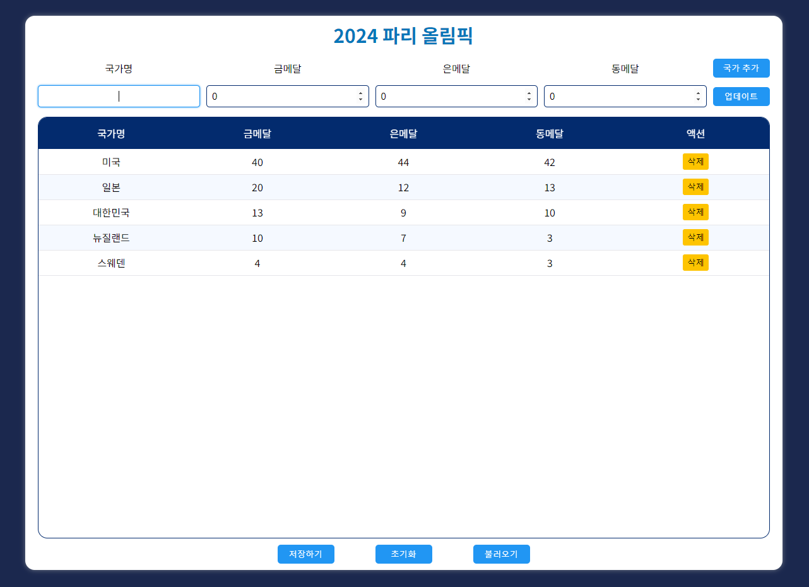

# 올림픽 메달 순위

올림픽 경기 결과를 직접 입력하면 메달 순위에 맞게 정렬해줍니다. React와 vite를 사용해 구현했습니다.

URL : https://olympic-ranking.vercel.app/

### 제공하는 기능
1. 메달 순위에 따른 정렬
2. 입력된 데이터 변경 및 삭제
3. 로컬스토리지에 저장 및 불러오기

 

### 컴포넌트 분리
- `App3.jsx`

  1. 같은 파일 내에서 `MakeTable`과 `SaveData`로 분리함.
  2. `<table>` 전체를 `MakeTable`로 분리함.
      - 전체 데이터 `data`에서 각 입력 정보를 가져와 하나의 행을 이룸.
  3. 하단의 입력 데이터 전체를 저장, 초기화, 불러올 수 있는 버튼이 모여있는 `<footer>` 태그를 연습을 위해  `SaveData`로 분리함.
  4. 위 두 컴포넌트는 `data`와 `setData`를 props로 전달받음.

- `App4.jsx`

  1. 반복되는 구조인 `<input>`, `<tr>`와  `<button>`를 각각 `InputBox.jsx`, `Row.jsx`와 `Button.jsx`로 분리하여 적용함.

- `App5.jsx`

  1. `./src/components`폴더에 있는 컴포넌트들로 구분함.
  2. `Olympic.jsx` : 제목을 포함하고 있으며 `OlympicHead.jsx`, `OlympicTable.jsx`, `DataSaver.jsx`로 구성됨. 데이터를 입력받기 위한 각종 `useState`들이 포함되어 있으며, `국가 추가`, `업데이트` 버튼의 `onClick` 이벤트에  사용되는 함수들을 포함함.
  3. `OlympicHead.jsx` : `<form>` 태그가 대부분임.
  4. `OlympicTable.jsx` : 기존 `MakeTable`을 자식으로 갖는 `
`로 구성.
  5. `DataSaver.jsx` : 표 하단의 local storage에 데이터를 저장하는 것과 관련된 버튼으로 구성됨. 이와 연결된 local storage에 저장하고 저장된 데이터를 불러오는 함수로 구성됨.

 
 

# 기능 설명

### 1. 메달 순위에 따른 정렬

금메달, 은메달, 동메달 개수가 많을수록 상위에 위치함. 위 이미지에서 스웨덴과 금메달 개수가 같은 아일랜드 데이터를 입력하면 아래와 같다.

각 `<input>`에 state를 연결해 상태를 관리했다. `data`에 추가할 새 입력 데이터에 해당하는 별도의 `row` 변수를 만들었으나 불필요한 부분인 것 같아 주석처리했다.

### 2. 입력된 데이터 변경 및 삭제
이미 입력된 대한민국 데이터를 추가로 입력하게 되면 알림창이 뜬다.

이때 업데이트 버튼을 누르면 메달 개수가 변경된다.

또한 없는 데이터를 업데이트하려는 경우 추가하라는 알림창이 뜬다.

삭제 버튼을 누르면 확인창과 함께 해당 데이터가 삭제된다.

데이터 삭제는 `setData`를 이용해 구현했다. 표의 해당 행은 추가로 삭제하지 않아도 된다. 

### 3. 로컬스토리지에 저장 및 불러오기
하단 저장하기 버튼을 누르면 로컬스토리지에 현재 입력된 데이터를 저장하고, 불러오기 버튼을 누르면 로컬스토리지에 저장된 데이터를 불러온다. 이때 저장된 데이터가 없는 경우 저장된 데이터가 없다는 알림창이 뜬다.

### 기타
- 입력 항목이 많아지면 표의 첫 행은 `position:sticky`를 사용해 상단에 고정되어 있도록 설정했다.

- 데이터를 추가하거나 업데이트 하는 경우 모든 `<input>`이 초기화되도록 설정했다.